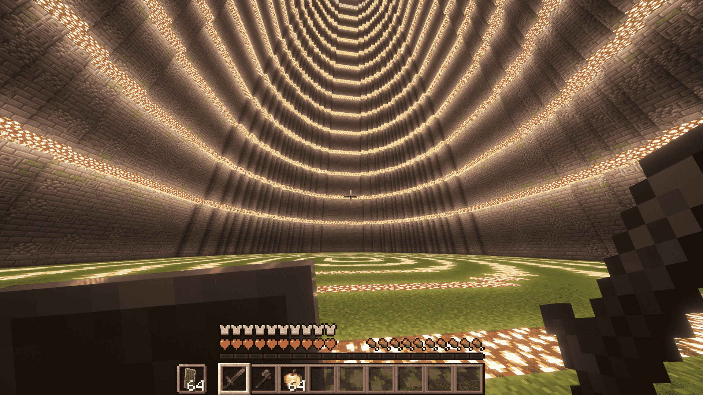

<div align="center">
    
</div>

### <div align="center">A Simple Dueling Plugin for Minecraft Servers.</div>

## <div align="center">Features</div>
- Dueling system
- Win/loss/kills/deaths tracking
- Configurable
- GUI

## <div align="center">How to Install</div>
1. Download the latest release of DuelCraft
2. Drop the `duelcraft-version.jar` file into your server's `./plugin` folder
3. Reload/restart your server
4. You're done

## <div align="center">How to Use</div>
Players are able to engage in duels via the command `/duel [opponent_name]`. The opponent will have to accept
the request before the duel starts. Duel requests expire after a configurable amount of time. Additionally, the command `/duel` will open a GUI for players to select who to challenge.

### Commands
- `/duel [player_name]`: If player_name is left blank (e.g. `/duel`), this command will open a GUI menu to interact with DuelCraft. If player_name is provided (e.g. `/duel CKAY_9`), it will try to send a duel challenge to the provided player.

## <div align="center">Developing (also useful to server owners)</div>
DuelCraft uses Spigot API v1.20.6, but works with (from what I have tested) Minecraft v1.20.6+. The structure of DuelCraft as a system is pretty simple. 

### Initialization, onEnable()
- Initialize storage files (config and data) and register tasks, listeners, commands, etc.

### User Interaction
- Handle user inputs, either through the command or the GUI
- (GUI) Either invite/create a duel, accept a duel, or view admin utilities (OP permissions required)
- (Command) Open GUI if no arguments are provided, otherwise send duel challenge to the first argument

### Matches
- Matches have three "phases" (booleans): accepted, started, ended
- Players can't send other invites if they already have an outgoing request
- Once the challenged player accepts, a five second countdown starts where the "arena world" (flat world) is generated (`accepted = true`)
- At the end of the countdown, the players are teleported to the arena world at different locations (`±(arena_radius * 0.5)` on the center X position) and given the items provided in the config (`started = true`)
- Matches end when a player will be below `0.5` HP (half a heart), leave, or just die. Another five second countdown begins, match results are announced (`ended = true`)
- At the end of the countdown, the players are teleported back to their original location (world and position) and given their items back

### Storage
- Player data is saved in a file named `/plugins/DuelCraft/data.yml`
- Players stats are updated at the end of each match
- YAML layout: 
```
data.yml

players:
    [player_uuid]:
        wins: int
        losses: int
        kills: int
        deaths: int
    ...
```


<div align="center">
    
    
    
    
    
</div>